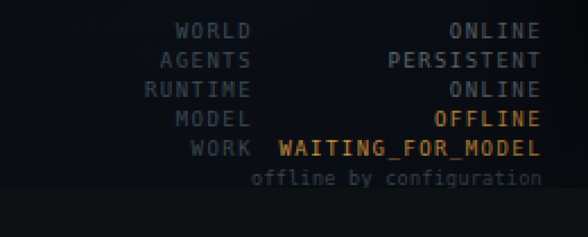

# Ownership and independence

*Who actually owns the Agent World, what it depends on, and what happens when
each of those dependencies disappears.*

The question this document answers is not "is it good". It is: **if every
company involved vanished tomorrow, what would the Owner still have?**

Run the proof yourself:

```
python3 offline_demo.py --fresh      # boots with no key, no network, no engine
python3 -m unittest test_always_on   # 156 tests, including the 16-step drill
```

---

## 1. The boundary

There is exactly one place in this codebase where a model can be reached:
`core/provider.py`, behind an abstract `Provider` with three methods —
`available()`, `why_unavailable()`, `complete()`. Everything above it is
ordinary local software.

```
    OWNER
      │
      ├── world_server.py · world_ui/      the Owner's view, read-only
      ├── core/world_supervisor.py         who works, on what, under which law
      ├── core/world_bus.py                the queue, claims, recovery
      ├── core/always_on.py                opportunities, teams, memory, lessons
      ├── core/agent_world.py              five persistent identities
      ├── core/world_policy.py             gates, budgets, chain ceilings
      ├── core/store.py                    the ONLY thing that opens a database
      │
    ══╪══════════ core/model_gate.py ═══════ the boundary ══════════════
      │
      └── core/provider.py                 interchangeable execution engines
             NotConfigured · LocalProvider · MockProvider · ClaudeProvider
```

Above the line, no module names a vendor. That is not a style preference; it is
an assertion in the suite (`ModelIndependence.test_no_module_above_the_gate_
names_a_vendor`), which greps seven core modules for `anthropic`, `openai`,
`claude`, `gpt-` and `api_key` and fails the build if any appears.

A second assertion checks the same for *identity*:
`test_an_agent_identity_carries_no_provider_state` serialises an agent's whole
row and fails if a vendor name, a key or even a runtime name appears in it. An
agent is a row with a name, capabilities, a contract and memories. It has no
idea what will execute it.

**Dependencies, complete list:** Python 3 and its standard library. That is
all. No pip install, no package.json, no container, no build step. The
persistent store is SQLite, which ships inside Python.

---

## 2. What happens when each dependency disappears

### The Claude subscription ends

Nothing in the world changes except that inference stops.

This is drilled explicitly in `SubscriptionFailure.test_the_whole_drill`, a
16-step test that builds a complete world, configures a cloud provider, removes
it mid-flight, restarts the process and checks every table. Steps 9–13 assert
that principals, projects, memories, tasks, artifacts, events, reviews,
evidence and opportunities all still have exactly the counts they had before;
step 10 that all five agents still exist; step 14 that work needing inference
becomes `WAITING_FOR_MODEL` and **no new `runs` row appears**; step 15 that the
Owner's view still renders and reports `MODEL: OFFLINE`.

Practically: the world keeps running, deterministic tool work keeps happening,
and work that needs a model waits for one. When a model returns,
`resume_waiting()` puts the parked entries back to `READY` and they are done
then. Parked is not lost.

### The OpenAI subscription ends

The same, and for the same reason: OpenAI was never depended on. `CIV_PROVIDER`
is the only way a cloud adapter is ever selected, and it must be set
*explicitly by name*. A key sitting in the environment does not create a
dependency — `test_a_stray_api_key_does_not_acquire_a_vendor` puts an API key
into the environment and asserts the gate still selects nothing. That is how a
world acquires a vendor by accident, and it is closed.

### The Internet disappears

The world boots and runs. `OfflineBoot.test_the_world_boots_and_exposes_its_
state_with_sockets_blocked` replaces `socket.socket` with a class that raises
on construction and `socket.create_connection` with a function that raises,
then founds a world, runs a full project to `COMPLETED`, projects the Open
World, renders the Owner payload and verifies the event chain — with every
socket in the process broken.

With `OFFLINE_MODE=1` the gate will not attempt even a localhost call.
`discover_local()` returns `[]` by configuration rather than by failure.

### The cloud provider disappears

There is no cloud provider. The world is a file.

Every row lives in one SQLite database. There is no hosted service, no
account, no control plane belonging to anyone else, and no phone-home. The
Postgres dialect in `core/dialect.py` exists so the same code *could* run on a
server the Owner chooses — it has never been executed against a live Postgres,
and the module says so in its own docstring.

### The computer restarts

The world resumes from disk. Nothing is held in memory that matters:
identities, memories, projects, tasks, the queue, the event chain, budgets and
policies are all rows. `CrashRecovery.test_a_world_resumes_from_disk_with_no_
loss` proves it, and `always_on_demo.py --crash-at N` lets the Owner do it by
hand — kill the supervisor mid-flight, reopen the world, watch it carry on.

### The World process crashes

Work claimed by a dead worker comes back. Claiming is a guarded
`UPDATE … WHERE state='READY'`, so a crash between claim and completion leaves
a `CLAIMED` row with a dead worker; `recover_stuck()` returns it to the queue.
`test_work_claimed_by_a_dead_worker_comes_back` and
`test_nothing_is_completed_twice_or_billed_twice` cover both halves: the work
is not lost, and it is also not done twice.

### The local model is removed

Exactly the same behaviour as a cancelled subscription, because at this
boundary there is no difference between them. `NoFakeAutonomy` runs a whole
world against a provider that reports itself unavailable and asserts: work is
`WAITING_FOR_MODEL`, `runs` is 0, `artifacts` is 0, `reviews` is 0, no task
reached `ACCEPTED`, **and no lease was taken** — a lock is never acquired for
work nobody can do.

### The database is restored from backup

It is the same world. `world_export.py` writes **every table in the database**
to one JSON file: 47 named explicitly in parent-first order, plus any others
the database happens to carry, appended. The bundle holds a checksum over the
data, the event chain head and the agent list. `restore_world()` refuses a
bundle whose checksum does not match, rebuilds into a fresh database, and
reports whether the chain is intact and the foreign keys are valid.
`compare()` then hashes every table on both sides.

Measured on the world `offline_demo.py` builds: **52 tables scanned, 161 rows
in the 24 that had any, 68 KB, 0 tables differing after restore, chain intact,
foreign keys valid.**

The five appended tables are the sealed benchmark tables. Export only reads
them, and `restore_world()` always writes into a fresh database — it deletes
the target or refuses to touch an existing one without `--force` — so a restore
can never write over a sealed campaign in a working database.

---

## 3. What the Owner is told

The five lines in the bottom-right of the Open World, and in
`model_gate.status()`:

```
    WORLD:    ONLINE              this process is running
    AGENTS:   PERSISTENT          five identities exist as rows
    RUNTIME:  ONLINE              the database answered
    MODEL:    OFFLINE             nothing is executing agent turns
    WORK:     WAITING_FOR_MODEL   n items parked, not lost
```



`MODEL` is whatever actually answered. It is computed by asking the selected
provider `available()`, never by assuming. `test_status_never_flatters_an_
absent_engine` asserts that with no engine the status says `OFFLINE` **and
carries a non-empty reason**.

This matters more than it looks. A world that shows agents moving around while
nothing is executing them is a screensaver. The rule here is: an agent that did
not run did not run, and the world says so on its own screen.

---

## 4. Local first, by construction

`model_gate.select()` tries local before cloud **in every mode that permits
cloud at all**. `OPEN` does not mean "prefer cloud"; it means "local, and cloud
only if the Owner explicitly named one". The dependency is never allowed to
form in the other direction.

The Owner names their runtime with two vendor-neutral variables:

```
LOCAL_MODEL_URL=http://127.0.0.1:11434      # or any host the Owner runs
LOCAL_MODEL_NAME=<whatever they installed>
```

**Nothing is guessed.** `LocalProvider` has no default model name, and
`test_no_model_name_is_ever_hardcoded` scans `core/provider.py` for
model-shaped defaults and fails if one appears. A hardcoded model name is a
guess about someone else's machine, and a wrong guess looks exactly like a
broken world. If the Owner sets no name, the gate *asks the runtime what it
has* (`/api/tags`, then `/v1/models`) and uses the first thing it reports.

Three modes, set by environment and nothing else:

| mode | set by | behaviour |
|---|---|---|
| `OFFLINE` | `OFFLINE_MODE=1` | no network call of any kind, not even localhost |
| `LOCAL_ONLY` | `LOCAL_ONLY=1` | local endpoint only; a configured cloud is refused |
| `OPEN` | default | local first; cloud only if `CIV_PROVIDER` names one |

---

## 5. Moving the world to a machine the Owner owns

A computer that is switched off runs nothing. No architecture changes that.
What the architecture *can* do is make sure the world is not trapped on any
particular computer — so that "always on" becomes a question about which
machine the Owner chooses to leave running, not a question about whose service
is still in business.

```
python3 world_export.py export --db always-on.db --out world.json
#   → copy world.json to the other machine, by any means at all
python3 world_export.py verify --in world.json
python3 world_export.py restore --in world.json --db /new/machine/world.db
```

The bundle is plain JSON, checksummed, with no binary format, no proprietary
container, and no service required to read it. A laptop, a mini PC left on a
shelf, a Raspberry Pi, a rented Linux box the Owner controls — the world runs
on any of them, because the requirement is Python 3 and a filesystem.

The honest long-term shape of this is a small dedicated machine the Owner owns,
running the world continuously, with a local inference engine on it. That is a
one-off hardware cost and a standing electricity cost, instead of a
subscription that can be cancelled, repriced, or discontinued by someone else.

---

## 6. What this does **not** claim

**It is not free.** The API spend is zero, and that is a real and measurable
saving. The total cost is not zero: the machine is bought once and the
electricity is paid for continuously. A local engine that is actually useful
also wants memory and, for reasonable speed, a GPU. Calling that "free AI"
would be a lie in the Owner's favour, so it is not said here.

**No inference is demonstrated.** Everything above shows that the world runs,
persists, recovers, projects and moves without a model. It does not show a
model thinking, because none was run — no real model has been called anywhere
in this work, by construction. `ScriptedWorker` in the demos is a deterministic
stand-in and says so in its own docstring; `LocalProvider` has been built and
tested against the interface, but **has never been run against a live local
runtime from this container.**

**What remains impossible without an inference engine:** the work itself.
Research, drafting, reviewing, judging — every task whose output is language —
cannot happen. The world will queue it, hold it, describe it, refuse to fake
it, and wait. Everything else — the queue, the laws, the budgets, the
identities, the memory, the projects, the tool calls, the evidence, the event
chain, the Owner's view, the export — keeps working. That is the whole claim,
and it is the entire claim.

---

## 7. Status

**LOCAL VERIFIED.** Everything in this document was executed on this machine
and is covered by the test suite. Not *cloud running*: nothing here has been
deployed anywhere. Not *production*: no real users, no real credentials, no
real money.
