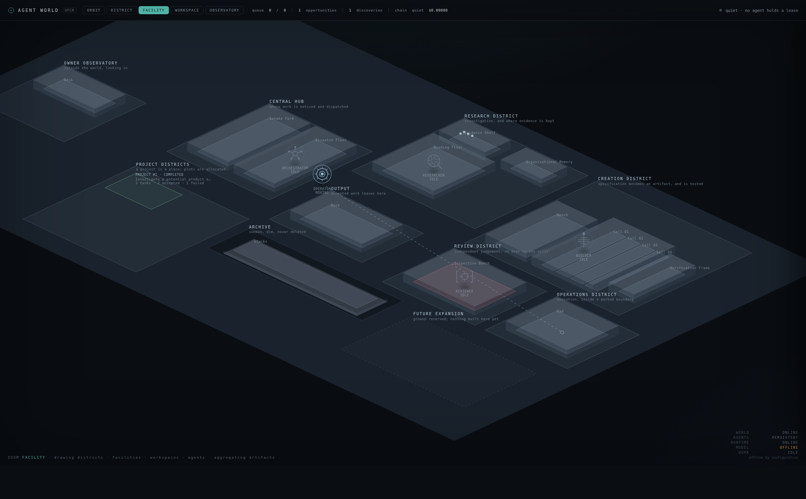
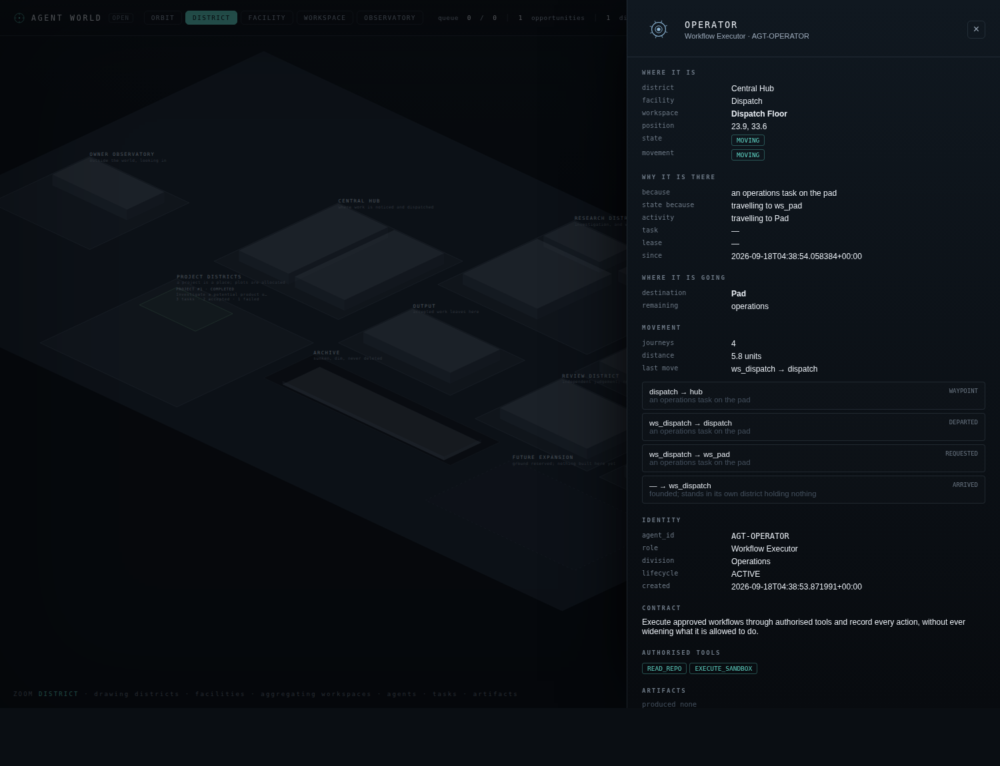

# The spatial world

*Agents now occupy a persistent, causally grounded space. This says what that
means mechanically, and what it still does not mean.*

```
python3 spatial_demo.py --fresh              # one objective; five agents travel
python3 spatial_demo.py --fresh --crash-at 6 # killed mid-journey, then resumed
python3 world_server.py --db spatial-world.db   # /3d is the WebGL world
```

The 3D environment built on this spatial state, and the pipeline that lets the
world build more of it, are [`WORLD_3D_AND_GROWTH.md`](WORLD_3D_AND_GROWTH.md).

---

## 1. What changed

Before, an agent's position was **arithmetic performed while drawing**.
`open_world` read the agent's task row, decided which workspace that implied,
and returned the centre of that rectangle. It rendered fine and was a different
kind of thing: nothing was anywhere between draws, an agent could not be
*partway* anywhere, two workers had nothing to race over, and a crash had no
position to lose because none had been written.

Position is now a row.

| | before | now |
|---|---|---|
| where an agent is | computed from its task at draw time | `agent_locations.x/y`, written when work sent it there |
| the map | a Python constant | `world_places`: 39 rows, districts ⊃ facilities ⊃ workspaces |
| being in transit | not representable | `movement='MOVING'` with a destination and remaining waypoints |
| after a restart | recomputed from tasks | read back exactly, mid-journey included |
| two workers moving one agent | last write wins | one journey; the rest refused and recorded |
| why an agent is somewhere | inferred from its task | `movements`: who, from, to, why, task, lease, worker, when, result |

---

## 2. The three tables

**`world_places`** — the coordinate tree. A district owns a rectangle, its
facilities sit inside it, workspaces sit inside those, and a test checks the
containment holds. Capacity is **derived from the size of the room**
(`w × h / 8`, minimum 1) rather than declared, because a hand-written number per
workspace is a second copy of the floor plan that drifts from the first.

**`agent_locations`** — one row per agent: workspace, x, y, destination, the
remaining waypoints, movement state, current activity, task, lease, why it is
there, when it last moved, and a `version`.

One row per agent is deliberate. **Two simultaneous movement commands for one
agent are not forbidden by a rule — they are unrepresentable**, which is the
stronger guarantee.

**`movements`** — append-only. Every transition, with the eight facts that make
a journey answerable from rows alone with no process running: *who* moved,
*from where*, *to where*, *why*, *because of which task*, *under which lease*,
*which worker* caused it, *when*, and what the result was.

Phases: `REQUESTED` → `DEPARTED` → `WAYPOINT`… → `ARRIVED`, plus `REFUSED` for a
move the world declined.

---

## 3. Movement is caused by work

`move_to` takes a mandatory reason. There is no overload that moves somebody for
no stated cause, and nothing in this world moves to look busy.

In practice one thing causes movement: **a task was assigned to an identity that
was somewhere else.** `h_task_ready` sends the agent to the workspace the task
belongs in and does it **before taking the lease** — an agent cannot hold a lease
on work it has not reached, and a test checks every `ARRIVED` precedes its lease.
`h_review_requested` sends the Reviewer to the Inspection Bench because an
artifact needs a verdict.

Nobody walks home afterwards. An agent standing where it last worked is the
truth; sending it back for tidiness would be movement the world invented. The
Operator does not move at all in a run that never gives it work — **idle is a
valid state**, and a test asserts it stays put.

> **One layout change made this load-bearing.** Every agent's home workspace used
> to be the bench where its own work happens, so an assignment never required
> anyone to go anywhere and the spatial model would have been decorative. Idle
> agents now stand at the Dispatch Floor, which is where work is noticed and
> handed out. A research assignment now genuinely requires crossing to the
> Research District, and that journey is persisted, recoverable and caused.

A route is structural: out through the facility, across at district level,
through the Central Hub, and down into the destination. Two refinements matter
and both came from reading the record rather than the code — a route must not
name the same place twice in a row, and it must contain **no leg of zero
length**, because a district whose single facility holds a single workspace has
all three centres at one point, and recording travel between them is movement
invented by the geometry.

---

## 4. Restart, and two workers

**Mid-journey survives.** A journey is a sequence of legs; between them the
agent is at a real coordinate with real waypoints left. Kill the process there,
reopen the database, and `workspace`, `destination`, `x`, `y`, `path`,
`movement`, `task_id`, `why` and `version` all come back identical — then a
*different* worker finishes the journey that was already under way.

**One agent, one journey.** Four workers asking for four destinations produce
exactly one `REQUESTED` row; the other three are refused and each refusal is
recorded with the worker that asked. Re-aiming is still possible by asking for
it — `redirect=True` is a decision somebody made, and it leaves a row saying so.

**A stale read loses.** Every write goes through a guarded
`UPDATE … WHERE principal_id=? AND version=?`, the same mechanism the queue uses
to hand one item to exactly one worker.

> The concurrency tests interleave workers sequentially rather than spawning
> threads. That is the pattern the existing multi-worker tests use, and it is
> deliberate: the property under test is that **no arrangement** of workers
> produces a double, which is a determinism property, not a scheduler one.

---

## 5. Six new laws (30–35)

Laws are database triggers because they have to hold when nobody is watching —
across workers, after a crash, and against a future caller whose `WHERE` clause
is wrong.

| law | what it refuses |
|---|---|
| **30** | a movement state that contradicts its own columns: `MOVING` with no destination, `ARRIVED` with none, `WORKING` with no task, **`IDLE` *with* a destination** |
| **31** | an agent standing anywhere but a workspace — a district is a region, not a room |
| **32** | more occupants in a workspace than it has room for |
| **33** | rewriting or deleting a recorded movement |
| **34** | finished work causing movement: a task already `ACCEPTED` or `ARCHIVED` sends nobody anywhere |
| **35** | the spatial version going backwards, which would let a worker replay a movement another already won |

LAW 30's `IDLE` clause exists because of a bug this work produced: a finished
journey left its destination in the row, so an agent standing still reported
that it was on its way to where it already was.

---

## 6. Level of detail

Occupancy is a `GROUP BY` over `agent_locations`, rolled up workspace → facility
→ district. The number costs the same and is correct at five agents and at any
other number, and no sprite is drawn to produce it.

Measured with every workspace filled to capacity — **112 agents, aggregation in
0.4 ms**, totals agreeing at all three levels, and the renderer still drawing
only the five founded crew while counting all 112.

**What that shows and does not show.** It shows the aggregation does not depend
on the population. It does **not** show 10,000 agents running: this world's
laid-out capacity is 112, and holding more means adding districts — which is
adding rows to a list, since the layout is data.

---

## 7. Security: a model may ask, the world decides

The runtime's vocabulary is `{"tool": …}`, `{"final": …}`, `{"answer": …}`.
**There is no movement verb**, `core/agent_runtime.py` does not import
`world_space`, no gateway capability writes a location, and tests assert all
three — including one that feeds hostile model output through the *real* parser
and checks that not one spatial column moved.

---

## 8. What is still not true

- **No inference happened.** Every run here is `ScriptedWorker`, a deterministic
  stand-in that is not a model and not intelligence. With no engine the world
  parks the work and says `MODEL: OFFLINE`, rather than manufacturing an
  artifact.
- **A journey completes inside one handler call.** The supervisor walks the
  whole route in one `travel()`, so a crash *between ticks* never catches an
  agent in transit. Mid-route recovery is real and tested, but `--crash-at`
  constructs the interruption deliberately and says so on screen.
- **Movement has no duration in world time.** Legs are recorded in order and the
  distance is real, but nothing models how long walking takes.
- **Agents do not avoid each other.** Capacity is enforced; pathing is
  structural, not collision-aware.
- **Nothing is deployed.** Status is LOCAL VERIFIED.

---

## 9. Where to look

| | |
|---|---|
| `core/space_schema.sql` | the three tables and laws 30–35 |
| `core/world_space.py` | places, routes, movement, occupancy, aggregation |
| `core/world_supervisor.py` | `_go_to_work`, `_go_to_review` — the only callers that move anyone |
| `core/open_world.py` | reads persisted positions; `workspace_of` still decides where work *belongs* |
| `spatial_demo.py` | the end-to-end proof |
| `test_always_on.py` | `SpatialPersistence`, `Navigation`, `MovementStates`, `SpatialConcurrency`, `SpatialCrashRecovery`, `MovementCausedByWork`, `SpatialCausality`, `WorkspacesAreReal`, `LevelOfDetail`, `SpatialSecurity`, `SpatialExportRestore`, `SpatialOwnerAbsence` |




