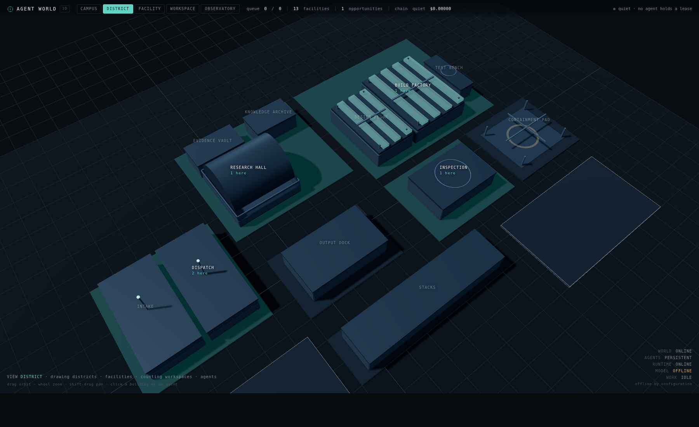
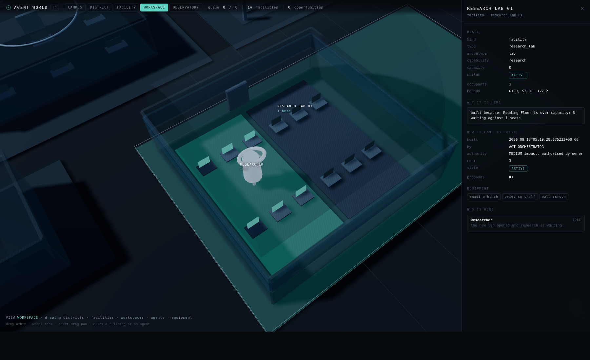

# The world you can walk into, and the world that builds itself

*Three things landed together: a real 3D environment, a construction pipeline the
organisation drives itself, and a capability graph that says what each agent can
actually do.*

```
python3 world_server.py --db spatial-world.db      # then open /3d
python3 growth_demo.py --fresh                     # the world builds a lab
python3 spatial_demo.py --fresh                    # five agents that travel
python3 -m unittest test_always_on                 # 271 tests
```

**The agents in it have bodies now** — a persistent physical identity per agent,
a workstation it holds, and an animation derived from the row that says what it
is doing. That is [`EMBODIED_WORLD.md`](EMBODIED_WORLD.md); this page describes
the campus they stand in.

---

## 1. The world is 3D now, and it is drawn from rows

`world_ui/three/` is a WebGL scene built on three.js r160, **vendored into
`world_ui/vendor/`** rather than fetched from a CDN. That is not fussiness: the
world has to boot with the network disabled, which `offline_demo.py` drills and
`OfflineBoot` asserts. A renderer that downloads its engine at load time would
make the Owner's world depend on somebody else's uptime — the exact thing
[`OWNERSHIP_AND_INDEPENDENCE.md`](OWNERSHIP_AND_INDEPENDENCE.md) exists to
prevent. A test greps the renderer for `http://`, `cdn.`, `unpkg` and `jsdelivr`
and fails on any of them.

**The renderer contains no `if facility == "research_lab"`.** Every place carries
a `type_id`, every type carries an `archetype`, and the scene builds from the
archetype — `lab`, `factory`, `chamber`, `pad`, `vault`, `stacks`, `hub`,
`ground`, `room`, and `block` for anything unregistered. That is what lets a
world that builds itself also be *seen*: a facility type invented next year
renders without anybody touching the renderer, and a test proves it by building
a new lab and asserting its id appears nowhere in the JavaScript.

> An earlier version resolved the archetype by matching a place's id against the
> type registry. The Archive **district** and the archive **facility type** are
> both called "archive", so the district rendered as a building. The type is a
> column now.

**Five embodiments, one species.** Each agent is a floating core over a base
ring in its state colour; what differs is the superstructure, which says what
the agent is *for* — the Orchestrator's five radiating arms, the Researcher's
lens assembly, the Builder's gantry, the Reviewer's calipers, the Operator's
concentric rings. No faces: a face is a claim about an inner life that nothing
here supports.

**Up close the shells go translucent.** A world whose agents are sealed inside
opaque boxes shows you a business park. At FACILITY and WORKSPACE zoom the
walls and roofs drop to 30% and 18%, and you see the desks, the lit screens and
the people at them.

**Navigation:** orbit (drag), zoom (wheel), pan (shift-drag), click any building
or agent, follow a selected agent, and four named views — CAMPUS, DISTRICT,
FACILITY, WORKSPACE — plus the Observatory. Deep links: `?place=lab`,
`?agent=AGT-RESEARCHER`, `?view=campus`, `?observatory=1`.

### What the renderer may not do

Interpolation is the only motion it owns: between two server reads an agent
slides from where it *was* to where it *is*. Both ends are rows. The slide is
the picture catching up, never the truth. There is no random walk, no patrol, no
idle animation — the single exception is that a RUNNING agent's core turns
slowly, which happens only while a lease exists and claims nothing about what
the agent is thinking. A room is lit because somebody is standing in it.

**If the runtime is idle, the factory looks idle.** A test founds a world,
renders it, and asserts every agent reads IDLE with no destination.

---

## 2. The world builds itself

The ten districts were a seed, not a maximum. When work stops fitting in the
space, the organisation notices and builds — through a pipeline it cannot skip:

```
OBSERVE → PROPOSE → DESIGN → VALIDATE → AUTHORISE → CONSTRUCT → ACTIVATE → OBSERVE
```

**OBSERVE** measures pressure from rows: seats against approved work that needs
this room's capability, plus anyone the room turned away. A world with room
proposes nothing, and a test asserts that — a system that always finds a reason
to expand has a broken detector, not ambition.

**PROPOSE** requires a cause *and* measured evidence. `propose()` refuses an
empty evidence dict outright.

**The scope is chosen by measuring, not preferring.** A new seat goes in the
room if the room has floor; a new room goes in the building if the building has
floor; a new building goes in the district; and if the home district is full,
it goes on the ground the world deliberately reserved. Only when nothing
standing has room does it claim new ground. In the demo the Research Hall is
physically full, so the world escalates to a facility and puts it on the
reserved expansion ground — which is what reserved ground is for.

**DESIGN** produces an artifact: coordinates, capacity, cost, equipment, and a
hash over the spec. LAW 40 freezes it once validated, so the thing built is the
thing that passed.

**VALIDATE** records twelve checks separately, so a refusal names which one
failed: hash matches spec, type registered, id free, parent exists, inside its
parent, no overlap, positive dimensions, budget available, ground available,
expansion rate, evidence present, proposer real, **grants no permissions**, and
capability registered.

**AUTHORISE**: workspace is LOW impact and may be autonomous under one resource
unit; facility is MEDIUM; district and new type are HIGH. **Absence of policy is
not permission** — a kind nobody wrote a rule for is HIGH and needs the Owner. A
test puts an agent through validation and then has it try to authorise its own
facility; it is refused and the proposal stays VALIDATED.

**CONSTRUCT** is the only function that writes geometry, inside one savepoint —
geometry without provenance is worse than no geometry. It also fits the facility
out with the workspaces its type declares, because a lab with no benches cannot
be entered.

**OBSERVE** measures utilisation afterwards from occupancy and arrivals, not
from anybody's opinion that it helped.

### The six construction laws (36–41), plus 42

| law | refuses |
|---|---|
| **36** | skipping a pipeline stage — `AUTHORISED` is not a column you can write |
| **37** | building on ground already built on |
| **38** | spending what the world does not have |
| **39** | construction without a validated design and a named authority |
| **40** | rewriting a design after it passed validation |
| **41** | rewriting or deleting what was built — retire it instead |
| **42** | a tool row that does not name the permission it requires |

### Bounded on purpose

Three resources — ground, construction capacity, budget — plus a **rate cap**,
because a limit on the total is not a limit if a loop can spend it in one tick.
An adversarial test runs 100 expansion attempts and asserts at most three
buildings appear. Another raises the budget to 99,999 and shows the world still
stops, because what actually ran out was somewhere to put the building: *every
bound is a separate bound, and money is not ground.*

---

## 3. The capability graph

`core/capability_graph.py` answers the other question about an agent: not where
it is, but what it can do.

```
AGENT → CAPABILITY → TOOL → PERMISSION → EXECUTION → ARTIFACT
```

Capability→tool edges live in the `capabilities` table as queryable state, and a
test asserts the renderer does not contain that mapping. A `tools` registry
describes each door — schema, risk, enabled, version — and **grants nothing**:
`runtime.Gateway` decides every call and decided so before this table existed. A
test registers a tool nobody holds and confirms the gateway denies it and
records the denial.

**Disabling a tool produces a real gap.** Turn off `READ_REPO` and the
Researcher's `research`, `evidence` and `read` capabilities go unusable, naming
`READ_REPO` as what blocks them. Turn it back on and they resume. A test asserts
the graph and the gap detector can never disagree — an earlier version matched a
tool's own `capability` field instead of the edges, so the graph said blocked
while the gap detector said fine.

The Orchestrator holds no tool at all, and its capabilities report `usable` with
`needs_tools: []`. That is a real answer — "this needs no door" — not a missing
mapping.

---

## 4. The acceptance test, run

`python3 growth_demo.py --fresh` — nobody edits the world by hand in it:

1. Six research tasks approved; the Reading Floor seats one.
2. Pressure measured: **×6.0** on `ws_lab`.
3. Proposal #1 with its evidence; scope escalated to a facility on reserved ground.
4. Design with hash; twelve validation checks, all passing.
5. **The world stops.** MEDIUM impact needs the Owner. `constructions: 0`.
6. The Owner approves → `research_lab_01` built at (61,53) 12×12, fitted out with
   Research Bench 01 and 02.
7. Ground 144/400, budget 3/50, construction 1/24 spent.
8. The Researcher walks in; utilisation measured: 1 occupant, 1 visit, UNDERUSED.
9. Restart: identical from disk, provenance intact, event chain verified.

Then `/3d?place=research_lab_01` shows it — with **WHY IT IS HERE** reading
*"built because: Reading Floor is over capacity: 6 waiting against 1 seats"* and
**HOW IT CAME TO EXIST** naming the builder, the authority, the cost and the
proposal.




---

## 5. What is still not true

- **No inference happened.** Every run here is deterministic; `ScriptedWorker` is
  a stand-in and says so. The research the new lab exists for still needs an
  engine, and without one it waits at `WAITING_FOR_MODEL`.
- **Agents cannot yet propose a new facility TYPE or a new tool.** The pipeline
  and the `type` impact class exist; nothing drives them from a capability gap
  yet, so §31 and §9-of-the-graph are scaffolded, not demonstrated.
- **No economy beyond three resources.** Expansions do not yet compete with
  other work for a shared budget.
- **Retirement is manual.** `retire()` exists and is tested; nothing decides on
  its own that a space should go.
- **Scale is proven at 112 agents and 14 facilities**, not thousands. The
  aggregation is a `GROUP BY` whose cost does not depend on population, and the
  growth mechanism is what was tested — not a crowd.
- **First-person navigation is not implemented.** Orbit, pan, zoom, focus and
  follow are.
- **Nothing is deployed.** Status remains LOCAL VERIFIED.
